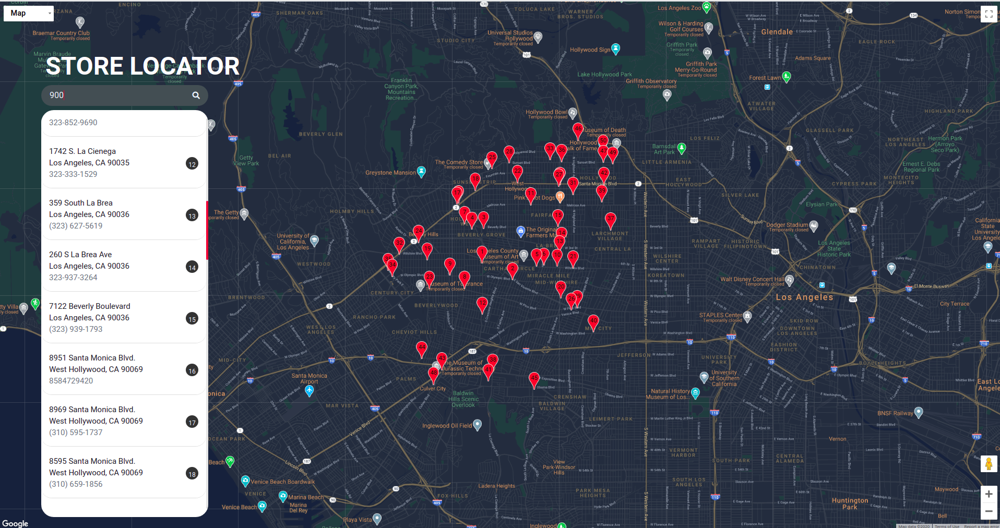

## Design Link

https://www.figma.com/file/hS9q9yTIxHhJLMKlYOqU7p/Google-Maps-(Copy)?node-id=0%3A1

# Plan Of Action
### Day 1
- Create wire frame DONE
- setup the base html structure DONE
- import google maps into the window DONE
- add the text store locator DONE
- Add input box DONE
- Add store list container DONE
- Add individual store container DONE
### Day 2
- style individual items in the store list <b>DONE</b>
- show all the stores in the stores list based on the real world data
-  show markers based on the real world store data
- May be give an info window when click on the individual store
- maybe  add a beautiful transition on hover on the individual store

